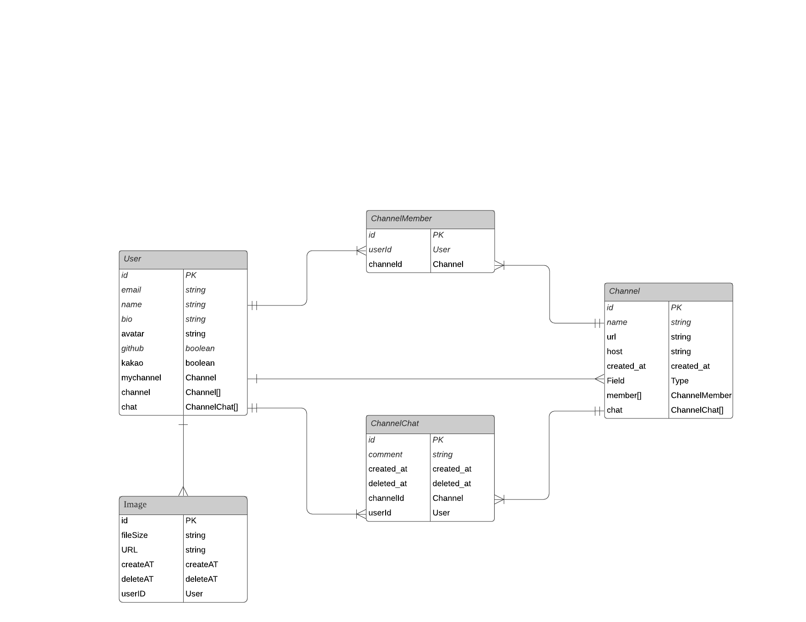

## Pro-4

## webRTC, socket.io를 이용한 디스코드?

## 시작

`docker compose up --build`

## db 접근

> docker ps
> docker exec -it pg컨테이너Id bash
> psql -U pro4
> \d 테이블 확인

## End Point

base URI = http://localhost

- uri/api

- uri/docs

## ERD

